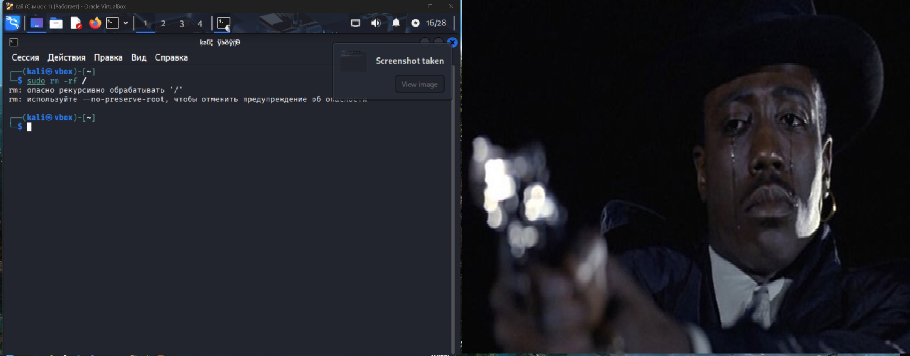
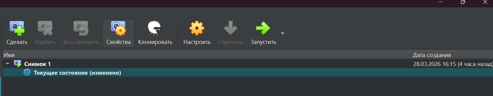
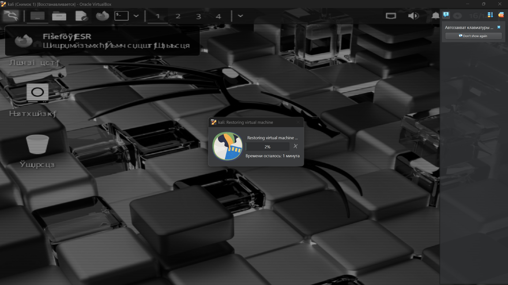

```
┌──(kali㉿vbox)-[~]
└─$ pwd                         
/home/kali
┌──(kali㉿vbox)-[~]
└─$ ls
 test    Документы   Изображения   Общедоступные   Шаблоны
 Видео   Загрузки    Музыка       'Рабочий стол'
                                                                                               
┌──(kali㉿vbox)-[~]
└─$ rm test    
rm: невозможно удалить 'test': Это каталог
                                                                                               
┌──(kali㉿vbox)-[~]
└─$ rm -r test
                                                                                               
┌──(kali㉿vbox)-[~]
└─$ ls        
 Видео   Документы   Загрузки   Изображения   Музыка   Общедоступные  'Рабочий стол'   Шаблоны
──(kali㉿vbox)-[~]
└─$ mkdir test
┌──(kali㉿vbox)-[~]
└─$ mkdir test
                                                                                               
┌──(kali㉿vbox)-[~]
└─$ 
                                                                                               
┌──(kali㉿vbox)-[~]
└─$ cd test     
                                                                                               
┌──(kali㉿vbox)-[~/test]
└─$ touch file.txt
                                                                                               
┌──(kali㉿vbox)-[~/test]
└─$ nano file.txt
                                                                                               
┌──(kali㉿vbox)-[~/test]
└─$ cat file.txt
123123123123
                                                                                               
┌──(kali㉿vbox)-[~/test]
└─$ head -n 5 file.txt
123123123123
                                                                                               
┌──(kali㉿vbox)-[~/test]
└─$ tail file.txt 
123123123123
                                                                                               
┌──(kali㉿vbox)-[~/test]
└─$ less file.txt

zsh: suspended  less file.txt
                                                                                               
┌──(kali㉿vbox)-[~/test]
└─$ tree         
.
└── file.txt

1 directory, 1 file
                                                                                               
┌──(kali㉿vbox)-[~/test]
└─$ rm -r test 
rm: невозможно удалить 'test': Нет такого файла или каталога
                                                                                               
┌──(kali㉿vbox)-[~/test]
└─$ rm file.txt
                                                                                               
┌──(kali㉿vbox)-[~/test]
└─$ ls           
┌──(kali㉿vbox)-[~/test]
└─$ cd  
                                                                                               
┌──(kali㉿vbox)-[~]
└─$ rm -r test
                                                                                               
┌──(kali㉿vbox)-[~]
└─$ ls
 Видео   Документы   Загрузки   Изображения   Музыка   Общедоступные  'Рабочий стол'   Шаблоны


что бы убрать пароль при использовании sudo 1 из варинатов прописать
sudo nano /etc/sudoers.d/nopasswd ввести пароль и после этого система 
перестанет просить пароль

```







